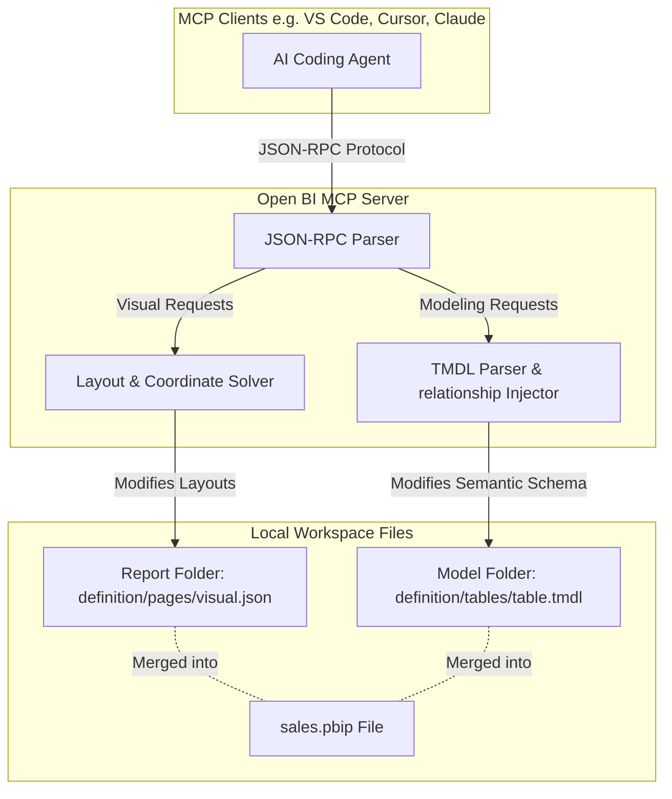

# Open BI: Local & Automated Power BI Developer Operations


**Open BI** is an open-source, local-first Model Context Protocol (MCP) server for programmatic Power BI report layout generation, tabular modeling, and version-controlled developer operations. 

By interfacing directly with Microsoft Fabric's new text-based report structures (**PBIR**) and Tabular Model Definition Language (**TMDL**), **Open BI** enables AI coding assistants (like VS Code, Cursor, and Claude Desktop) to design dashboards, run layout algorithms, insert DAX measures, and manage report states directly on local folders (`.pbip`).

---

## 🚀 Key Features

### 1. Enhanced Report Layout Automation (PBIR)
* **31+ Native Visual Types:** Instantiates and places everything from standard charts (Column, Bar, Line, Pie, Donut, Treemap, Waterfall, Combo) to advanced AI visuals (`decompositionTree`, `keyInfluencers`), maps (`azureMap`), gauges, KPIs, basic shapes, and images.
* **Layout Collision Auditor (`audit_layout`):** Scans the coordinates of all visual containers on a page, identifies overlaps, and automatically shifts elements downward to preserve clean, grid-aligned page hierarchies.
* **Modern Style Presets:** Instantly applies unified visual themes (such as `glassmorphism`, `darkMinimal`, `neonGradient`, and `redCorporate`) to cards, slicers, and containers, which merge with custom styling overrides.
* **Button Slicer Grid Auto-Sensing:** Configures the modern `advancedSlicerVisual` grid layouts, dynamically selecting rows/columns based on the visual's aspect ratio.

### 2. DevOps & Governance (TMDL)
* **Calculated Date Tables:** Dynamically generates calendar and date dimension tables with custom fiscal year starting months, complete with relationships injected directly into TMDL files.
* **Calculated Columns & Measures:** Programmatically appends DAX measures (YTD, MTD, Rolling Averages, and SAMEPERIODLASTYEAR YoY rates) and calculated columns to tables.
* **DevOps Snapshots:** Captures timestamped backups of your layout configuration folders.
* **Report Diffing:** Generates clear markdown comparisons showing structural additions, deletions, or coordinate moves between active layouts and snapshots.
* **Structural Linter:** Checks the entire `.Report` directory tree, ensuring schema consistency and producing 0-issue, clean compiles.

---

## ⚔️ Comparison: Open BI vs. Power BI Copilot

While Microsoft's built-in **Power BI Copilot** provides basic conversational assistance, it lacks the developer-centric, source-controlled workflows required for real-world report engineering.

| Feature / Capability | Microsoft Power BI Copilot | Open BI |
| :--- | :--- | :--- |
| **Execution Context** | Closed cloud service (requires Microsoft Fabric capacity or Premium licenses) | **100% Local & Free** (runs on a local Node.js environment, no subscriptions) |
| **IDE & Client Integration** | Closed sandbox pane inside Power BI Desktop/Web | **Standard MCP Server** (connects directly to VS Code, Cursor, Claude Desktop, etc.) |
| **Source Control & Git** | None (operates on active session memory, ignored by Git) | **Git-First** (creates human-readable, commit-friendly PBIR and TMDL folder trees) |
| **Layout Management** | Manual (Copilot frequently drops visuals on top of each other) | **Offline Grid Layouts** (dynamic grid arranging and overlap solver) |
| **Semantic Modeling** | Limited to verbal measure suggestion | **Automated TMDL Modeling** (injects date tables, calculated columns, relationships, and KPIs) |
| **Aesthetic Theme Presets** | Default styles only | **Modern Design Sheets** (`glassmorphism`, `darkMinimal`, `neonGradient` presets) |
| **Version Control & DevOps** | None | **DevOps Tooling** (visual snapshotting, report diffing, and folder structural auditing) |

---

## 🏗️ System Architecture

**Open BI** operates as a JSON-RPC gateway bridge, translating instructions from your local IDE (acting as the MCP client) into disk-level adjustments inside your Power BI Project folder.



---

## 🛠️ Step-by-Step Installation

### System Requirements
* **Node.js:** Version 16 or higher installed on your machine.
* **Power BI Desktop:** Enhanced Report Format (PBIR) enabled (File > Options and settings > Options > Preview features > Store reports using Enhanced Report Format (PBIR)).

### 1. Download & Build Open BI
Clone or copy the **Open BI** project files into your local developer workspace:

```bash
# Navigate to the server folder
cd pbir-mcp-server

# Install dependencies (none required, standard Node.js runtime libraries only)
npm install
```

### 2. Verify Your Local Environment
Run the automated advanced offline test suite to ensure the layout solver and TMDL parsers are functioning correctly on your machine:

```bash
node test_advanced_mcp.js
```

### 3. Register with Your IDE (e.g., Claude Desktop)
Add the **Open BI** server details to your global Model Context Protocol configuration file (typically located at `%APPDATA%\Claude\claude_desktop_config.json`):

```json
{
  "mcpServers": {
    "open-bi": {
      "command": "node",
      "args": [
        "C:/Users/GTXS3893/.gemini/antigravity/scratch/PowerBi-Automation/pbir-mcp-server/index.js"
      ]
    }
  }
}
```
*(Replace the absolute path above with the exact location of the server's `index.js` file on your machine).*

---

## 📖 MCP Tool Reference

Once connected, your AI assistant will have access to the following programmatic tools:

### Project Connections
* `connect_project`: Scans and opens a local `.Report` folder.

### Layout & Page Management
* `create_page`: Generates a new report page folder and metadata.
* `add_visual`: Instantiates a visual container (supporting 31+ visual types).
* `create_table`: Constructs Pivot Tables (Matrix) and standard Tables.
* `format_visual`: Modifies backgrounds, titles, borders, data labels, and presets (`glassmorphism`, `darkMinimal`, etc.).
* `auto_arrange_page`: Auto-positions visuals using page grid templates.
* `group_visuals`: Groups visual containers together.
* `sync_slicers`: Configures slicer syncing.

### Modeling & Calculations
* `create_date_table`: Generates a standard DAX calendar table.
* `create_calculated_column`: Appends columns to tables.
* `validate_measures`: Offline and online syntax validations.
* `create_kpi`: Registers KPI objects.

### DevOps Operations
* `snapshot_report`: Backs up layout folders.
* `diff_reports`: Compares report structures and layouts.
* `validate_report`: Audits the directory tree for schema validation.
